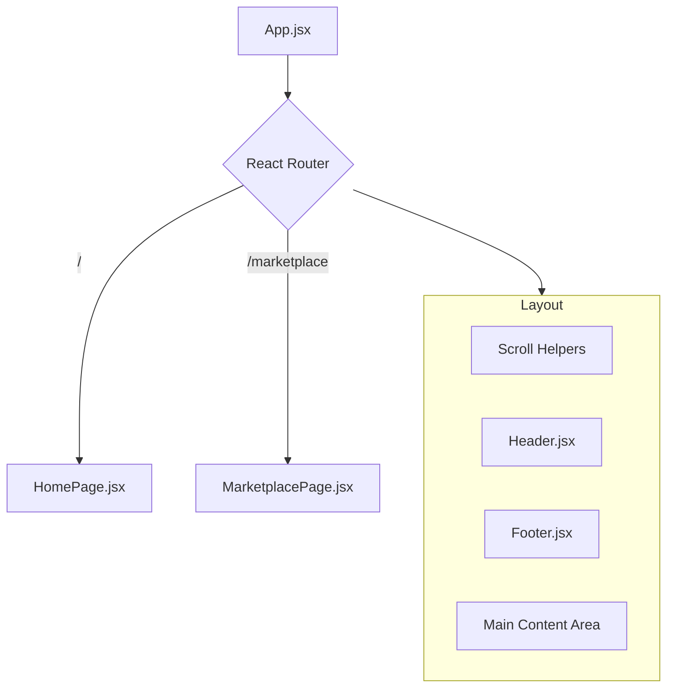
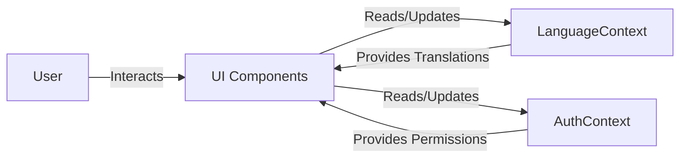

# 🏗️ Architecture Guide

This document provides a technical overview of "The Multilingual Mandi" codebase.

## 🧱 Component Structure

The application follows a standard React component tree structure.



## 🔄 State Management

We use React Context for global state management to avoid prop drilling.

### Core Contexts

1.  **AuthContext**: Manages user authentication state (Buyer vs Vendor).
2.  **LanguageContext**: Handles the active language (English, Hindi, etc.) across the application.



## 📂 Directory Structure

Here is an annotated view of the `src` folder:

```
src/
├── assets/          # Static assets (images, icons)
├── components/      # Reusable UI components
│   ├── Layout/      # Header, Footer, etc.
│   └── Shared/      # Buttons, Inputs, Scroll helpers
├── context/         # React Context definitions (Auth, Language)
├── data/            # Mock data or static configuration
├── pages/           # Page view components (Home, Marketplace)
├── App.jsx          # Main application root
└── main.jsx         # Entry point (rendering to DOM)
```

## 🔌 Routing

Routing is handled by `react-router-dom`.
-   `/`: Landing page.
-   `/marketplace`: Main listing area for products.
