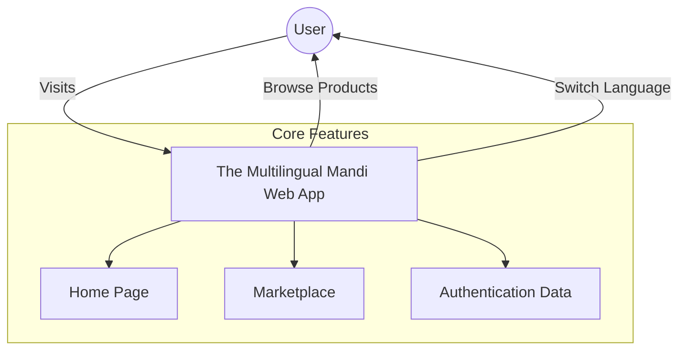

# The Multilingual Mandi 🌽

A digital marketplace connecting farmers and buyers with multi-language support.


## 📖 Introduction

**The Multilingual Mandi** is a web application designed to bridge the gap between farmers and the market. It offers a seamless experience for both **Buyes** (looking for fresh produce) and **Vendors/Farmers** (selling their harvest), with a strong focus on accessibility through multilingual support.

## ✨ Features

-   **Dual Role Support**: Dedicated interfaces for Buyers and Vendors.
-   **Multilingual**: Accessibility for users in different regions (Hindi, English, etc.).
-   **Modern UI**: Clean, responsive interface built with React and styled with CSS/Tailwind.
-   **Marketplace**: Browse and list agricultural products.

## 🛠 Tech Stack

-   **Runtime**: Node.js
-   **Framework**: [React](https://react.dev/)
-   **Build Tool**: [Vite](https://vitejs.dev/)
-   **Routing**: React Router DOM v6
-   **Styling**: Vanilla CSS / Tailwind (if configured)
-   **Linting**: ESLint

## 🧩 System Context



## 🚀 Quick Start

1.  **Clone the repository**
    ```bash
    git clone <repository-url>
    cd The-Multilingual-Mandi
    ```

2.  **Install dependencies**
    ```bash
    npm install
    ```

3.  **Start the development server**
    ```bash
    npm run dev
    ```

4.  **Build for production**
    ```bash
    npm run build
    ```

## 📂 Documentation

-   [**Architecture**](./ARCHITECTURE.md) - Deep dive into component structure and data flow.
-   [**User Guide**](./USER_GUIDE.md) - How to navigate and use the application.

---
*Built with ❤️ for farmers.*
