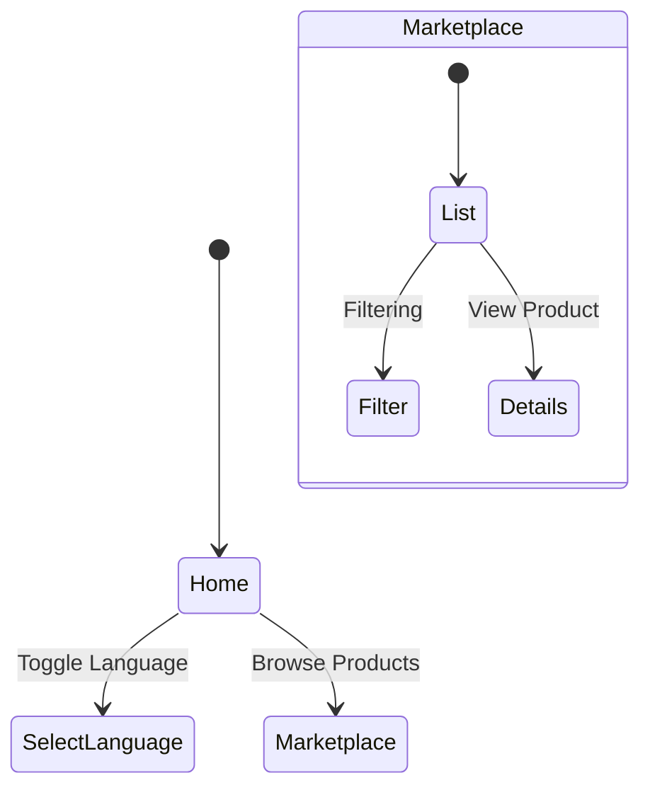

# 🧑‍🌾 User Guide

Welcome to **The Multilingual Mandi**! This guide will help you navigate the platform whether you are a buyer or a farmer.

## 🧭 Navigation Flow

## 🚀 Getting Started

### 1. Choose your Language
On the top right of the navigation bar, you will find a language selector. Click it to switch between available languages (e.g., English, Hindi).

### 2. Select your Role
The platform serves two main types of users:
-   **Buyers**: People looking to purchase fresh produce.
-   **Vendors (Farmers)**: People looking to sell their harvest.

### 3. Exploring the Marketplace
Click on **"Marketplace"** in the navigation menu to see all available listings.
-   **Browse**: Scroll through the list of fresh items.
-   **Filter**: Use the search or filter options to find specific crops (e.g., Wheat, Rice, Vegetables).

## 💡 Tips
-   **For Farmers**: Make sure your listings have clear images and prices.
-   **For Buyers**: Check the "Freshness" tag on items before buying.

---
*Need help? Contact support.*
